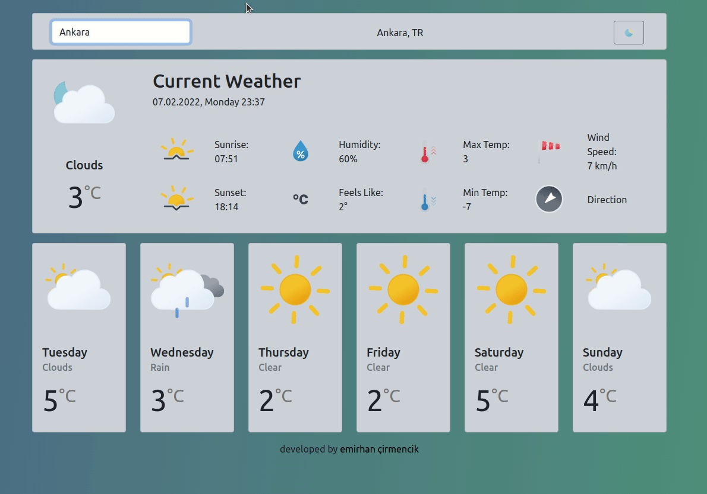

# React Weather App

[Live](weatherapp7d.netlify.app)

# Getting Started with Create React App

This project was bootstrapped with [Create React App](https://github.com/facebook/create-react-app).

## Available Scripts

In the project directory, you can run:

### `npm start`

Runs the app in the development mode.\
Open [http://localhost:3000](http://localhost:3000) to view it in your browser.

The page will reload when you make changes.\
You may also see any lint errors in the console.

### API
Open [Open Weather](https://openweathermap.org/) to register and get your API key.
Create a file called .env in the root of your project's directory.
Inside the .env file, prepend REACT_APP_WEATHER_API_KEY to your API key name of choice and assign it.
`//.env`
`REACT_APP_WEATHER_API_KEY={YOUR_API_KEY}`

### Icons
[Weather Icons](https://basmilius.github.io/weather-icons/)